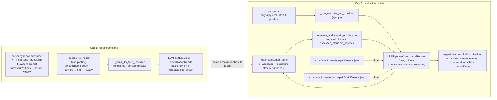

# Assignment 5 — Task 4: End-to-End LLM Pipeline + Course-Wide Comparison

## Context

Assignment 5 Tasks 1–3 are committed (LLM-FL `1f47f24`, patch assessment `a8bc291`, context retrieval `5d580cb`). Task 4 requires (1) a fully LLM-driven pipeline — **LLM-FL → LLM-Repair with retrieval → LLM-Assessment** — runnable via a **single CLI command**, and (2) running it on the Assignment-4 bugs with a **course-wide comparison** (A3 / A4 single-shot / A4 iterative / A5 full LLM) committed as artifacts.

All draft claims are now **verified against the code**. The pipeline is almost assembled — `repair --technique llm --retrieval-budget N --assess` already works end-to-end (assessor wired via `_build_assessor` at `cli/app.py:773`, retrieval trace + `assessed_plausible_patches` serialized by `RepairEvaluationRunner._serialise_bug` at `evaluation/repair_runner.py:298-419`). Exactly two gaps:

- **Gap 1:** `repair` cannot select LLM-FL. `--fl-mode` (`parser.py:712`) knows only `auto`/`perfect`; `_localize_for_repair` (`app.py:427`) has no LLM branch. `LLMFaultLocalizer` is only reachable via `localize --backend llm`.
- **Gap 2:** No command produces the four-approach comparison. A3/A4 numbers exist and are **loaded, not re-run**: `experiment_results/repair/results.json` (tornado:14, scrapy:2, black:1 — no fastapi:3 → renders `—`) and `experiment_results/llm_repair/task5/results.json` (all 4 bugs × 3 variants × 2 FL modes).

**Bug set:** `black:1, tornado:14, scrapy:2, fastapi:3` (the A4 set; all four checkout/compile/test successfully; tornado:14's only prior failure was FauxPy-on-py3.7.0, which LLM-FL bypasses). **Provider:** OpenAI — `gpt-5.4`, temperature `1.0`, `OPENAI_API_KEY`, `https://api.openai.com/v1`.

### ⚠️ Environment constraint (new — verified)

This remote session has **no Docker daemon, no `OPENAI_API_KEY`, no `.workspace/` checkouts**, and `docs/task5/` + `docs/Implementation5_1/2/3.md` are **untracked on the local machine and absent here**. Therefore:

- Code, docs, tests, lint (Steps 1–4, 6) are implemented and unit-verified in whichever session executes this plan.
- **Step 5 (experiments) and the mandatory Docker end-to-end validation must run on the local machine** (Docker + API key + checkouts). If this plan is implemented remotely, the PR ships code + docs, and the run procedure below is executed locally afterward to produce/commit `experiment_results/llm_pipeline/`.
- `docs/task5/Implementation5_4.md` is written fresh in the style of the README's Implementation sections; committing the untracked 5_1/2/3 docs is only possible locally.

## Shape of the change



## Step 1 — CLI grammar (`src/apr_framework/cli/parser.py`)

### 1a. `repair` subparser (starts line 550) — LLM-FL selection, after `--fl-mode` (~line 723)

- `--fl-backend` — `choices=["fauxpy", "llm"]`, `default="fauxpy"`, `dest="fl_backend"`. Help: FL backend used when `--fl-mode auto`; ignored under `--fl-mode perfect`.
- `--fl-system-prompt` (default `fl_prompt1`), `--max-source-lines` (default 400), `--source-window` (default 40) — **exact same dest names as the `localize` subparser** (`fl_system_prompt`/`max_source_lines`/`source_window`, parser.py:133-162) so one builder serves both commands. Verified `_build_llm_localizer_and_config_data` (app.py:829) reads only these dests plus `model`/`temperature`/`llm_provider`/`llm_base_url`/`llm_api_key_env`/`top_n` — all already on the repair subparser.

### 1b. New `bugsinpy evaluate-full-pipeline` subparser (next to `evaluate-llm-repair`, parser.py:~380-547)

Matrix: **bugs × one configuration** (4 cells). No `--fl-modes`/`--fl-family`/FauxPy knobs — FL is LLM by definition.

| Flag | Default |
|---|---|
| `--bugs` | `black:1,tornado:14,scrapy:2,fastapi:3` |
| `--model` / `--temperature` | `gpt-5.4` / `1.0` |
| `--llm-provider` / `--llm-base-url` / `--llm-api-key-env` | `openai-compatible` / `https://api.openai.com/v1` / `OPENAI_API_KEY` |
| `--system-prompt` / `--fl-system-prompt` | `prompt1` / `fl_prompt1` |
| `--max-source-lines` / `--source-window` | `400` / `40` |
| `--retrieval-budget` | `3` |
| `--assess` (BooleanOptionalAction) / `--assess-system-prompt` / `--assess-max-patches` | `True` / `assess_prompt1` / `None` |
| `--context-enrichment` (BooleanOptionalAction) | `True` |
| `--iterative` (BooleanOptionalAction) / `--max-iterations` | `False` / `5` |
| `--max-candidates` / `--top-n` | `3` / `3` |
| `--budget` / `--timeout` | `200` / `120` |
| `--stop-on-first` / `--no-regression-check` / `--ranker` / `--ranker-weights` | off / on / `none` / `None` |
| `--output-dir` / `--runs-dir` | `experiment_results/llm_pipeline` / `runs` |

`_build_assessor` (app.py:773) reads exactly `assess, llm_provider, model, temperature, llm_base_url, llm_api_key_env, assess_system_prompt, assess_max_patches, timeout` — all present above (verified).

## Step 2 — LLM-FL branch for repair (`src/apr_framework/cli/app.py`)

- **Refactor:** extract the localizer-construction half of `_build_llm_localizer_and_config_data` (app.py:838-850 — builds `LLMLocalizationConfig` + `OpenAICompatibleClient` + `LLMFaultLocalizer`) into `_build_llm_fault_localizer(args, adapter) -> FaultLocalizer`. The original keeps its signature and becomes: build localizer via the new helper, then build the config payload (the payload half reads `args.project`/`args.bug`, which the localizer half never touches).
- **New helper** `_run_llm_fault_localization_for_repair(args, adapter, checkout, writer) -> LocalizationResult` — mirrors `_run_perfect_localization_from_developer_fix` (app.py:463): logs start (model + `fl_system_prompt`), calls `_build_llm_fault_localizer(args, adapter).localize(checkout.bug, checkout)`, logs ranked-location count and `metadata["files_shown"]` (the documented misfire signal — verified key at `localization/llm.py:355`).
- **New branch in `_localize_for_repair` (app.py:427)** between the cached and FauxPy branches — precedence **perfect → cached (`--skip-localize`) → llm (`args.fl_backend == "llm"`) → fauxpy**; update docstring. Log a warning when `--fl-mode perfect` + `--fl-backend llm` (perfect wins).
- **`_build_repair_config_data` (app.py:355):** replace the line-368 ternary with `_resolve_repair_fl_backend_label(args) -> str` (`"oracle"` / `"llm-fl"` / `args.fl_family`), record `fl_backend_choice` = `args.fl_backend`; when LLM-FL also record `fl_system_prompt`, `fl_max_source_lines`, `fl_source_window`.

## Step 3 — New runner: `src/apr_framework/evaluation/full_pipeline_comparison_runner.py`

Mirrors `LLMRepairComparisonRunner` (`evaluation/llm_repair_comparison_runner.py`): incremental `results.json` flush after every cell, per-cell `run_NNN` via `RunWriter` + `RepairEvaluationRunner`, `write_results`, `copy_run_artifacts`, `_summarize_error`, `_unique_ordered`. Differences:

- **`FullPipelineCellResult` dataclass** — `LLMRepairCellResult`'s metric fields minus the `variant_label`/`fl_mode` axes, plus:
  - FL evidence (from in-memory `LocalizationResult.metadata` — keys verified at `localization/llm.py:349-359`): `fl_location_count`, `fl_had_traceback`, `fl_files_shown`.
  - Retrieval (aggregated from per-patch `retrieval` blocks in `repair_results.json` — shape verified at `repair_runner.py:398-419`: `{"steps": [{tool_name, argument, result_summary}], "step_count", "stop_reason"}`, present in both `plausible_patches` and `all_results`; aggregate over `all_results` to count every prompt's retrieval): `retrieval_step_total`, `retrieval_tool_call_counts: dict[str, int]`, `patches_with_retrieval_count`.
  - Assessment (from `assessed_plausible_patches` — entries carry `is_correct`, `rank_position`, `metadata.quality_score`, `metadata.assessment_rationale`; plus `metrics.assessment_query_count`): `assessment_query_count`, `assessed_patch_count`, `best_quality_score`, `is_top_assessed_patch_correct`.
- Constructor takes an **`assessor_factory: Callable[[], PatchAssessor | None]`** — fresh assessor per cell keeps `assessment_query_count` isolated (`LLMPatchAssessor` counts on the instance, `repair/assessment/llm.py:41`; same rationale as fresh LLM client per cell). Pass the built assessor into `RepairEvaluationRunner(assessor=...)` — the parameter already exists (`repair_runner.py:83`).
- Cell `config.json` payload includes `"runner": "full-pipeline-comparison"`, `fl_backend="llm-fl"`, all FL/retrieval/assess knobs.
- Helpers (verb-first, per naming rules): `_run_one_cell`, `_build_cell_from_run_dir_and_localization`, `_summarise_retrieval_from_patches`, `_summarise_assessment`, `_write_json`.
- **README generation:**
  - Per-bug pipeline table: Queries | Generated | Plausible | Correct | 1st plausible (s) | Retrieval steps | Best quality score | Outcome.
  - `_build_course_wide_comparison(cells)` — per-bug table (rows: FL source, Repair, Assessment, Plausible, Correct, Time to first plausible; columns A3 / A4 single-shot / A4 iterative / A5 full LLM). A3/A4 columns pick the **best cell across {auto, perfect}** (max correct → max plausible → min time-to-first-plausible), annotated with the winning FL mode, e.g. `1 (perfect)`; rule stated in a footnote. A4 columns filter `variant == "single-shot"` / `"iterative"`; context-enriched covered in prose.
  - Loaders `_load_assignment3_results_by_bug()` / `_load_assignment4_results_by_bug_and_variant()` read the two committed JSONs (row shapes verified above) with graceful degradation — missing file/bug → `—` — modeled on `_load_template_correct_by_bug` (`llm_repair_comparison_runner.py:575`).
  - Auto-written discussion sections: `_build_llm_fl_quality_analysis` (LLM-FL vs SBFL — tornado:14 is the headline: A3/A4 auto-FL cells were FauxPy errors, LLM-FL runs), `_build_retrieval_effect_analysis`, `_build_assessment_quality_analysis` (does the top-assessed patch coincide with the correct one), `_build_overall_pipeline_analysis`.

## Step 4 — CLI handler `_run_evaluate_full_pipeline` (`cli/app.py`)

Modeled on `_run_evaluate_llm_repair` (app.py:1565), simplified (single-config matrix, no FauxPy machinery):

1. `adapter.toolchain.ensure_installed()` unconditionally (LLM-FL runs the trigger test in the executor to capture the traceback). `_parse_bug_list(args.bugs)`; validate all checkouts up front (same worktree loop as app.py:1613-1636).
2. `localization_provider(canonical_bug)` → fresh `_build_llm_fault_localizer(args, adapter).localize(canonical_bug, checkouts[canonical_bug])`.
3. `repair_algorithm_factory(localization_result)` → new `_build_llm_algorithm_for_full_pipeline(args, localization_result, adapter)` — like `_build_llm_algorithm_for_variant` (app.py:1520) but sets `retrieval_budget=args.retrieval_budget`, `context_enrichment=args.context_enrichment`, `iterative=args.iterative`, `few_shot_count=0`; fresh `OpenAICompatibleClient` per cell. (**Do not** touch `_build_llm_algorithm_for_variant` or `_LLM_VARIANT_TOGGLES` — A4 cells must stay retrieval-free.)
4. `assessor_factory` → `lambda: _build_assessor(args, adapter)`.
5. Build `repair_config_data`, run matrix → `write_results` → `copy_run_artifacts` → `_print_full_pipeline_summary(cells)` (compact table like `_print_llm_repair_summary`, app.py:1750).
6. Dispatch branch `if args.bugsinpy_command == "evaluate-full-pipeline"` next to the others (app.py:~258).

## Step 5 — Run experiments and commit artifacts (LOCAL machine only)

Requires Docker + `OPENAI_API_KEY` + checked-out bugs — not possible in the remote session. Committed outputs: `experiment_results/llm_pipeline/{results.json, README.md, run_artifacts/run_NNN/…}` (config.json, execution.log with LLM-FL + retrieval-trace + assessor lines, repair_results.json with `retrieval` blocks and `assessed_plausible_patches`), plus the single-command demo run referenced from the README.

## Step 6 — Documentation

1. **README.md** — new `## End-to-End LLM Pipeline and Course-Wide Comparison (Assignment 5 — Task 4)` after the Task-3 section (insert before `## Summary`, currently line ~1900): pipeline description, the single command:
   ```bash
   python -m apr_framework repair --project black --bug 1 \
     --fl-backend llm --technique llm --retrieval-budget 3 --assess \
     --model gpt-5.4 --temperature 1.0 \
     --llm-base-url https://api.openai.com/v1 --llm-api-key-env OPENAI_API_KEY
   ```
   `evaluate-full-pipeline` usage, flag semantics (`--fl-backend` vs `--fl-mode`, shared provider flags across FL/repair/assessment), the course-wide table, pointer to `experiment_results/llm_pipeline/README.md`.
2. **docs/task5/Implementation5_4.md** — written fresh (goal, files-touched table, `--fl-backend` precedence design, runner design, debugging notes on `fl_files_shown`). The sibling Implementation5_1/2/3.md files are untracked locally and unavailable remotely — mirror the README's section style instead; if implementing locally, commit the whole `docs/task5/` directory in this sprint.
3. **CLAUDE.md** — single-command example + `evaluate-full-pipeline` under Key commands; `full_pipeline_comparison_runner.py` in the architecture tree; one Key-design-decisions paragraph.
4. **tests/test_imports.py** — add `"apr_framework.evaluation.full_pipeline_comparison_runner"` to `MODULES`.
5. No "Task-X"/"Assignment-X" labels inside `.py` files (docs/README only).

## Verification

**In the implementing session (always):** `pip install -e .`, `pytest tests/`, `ruff format . && ruff check .`, plus a `build_parser()` smoke check that `repair --fl-backend llm` and `bugsinpy evaluate-full-pipeline` parse with expected defaults.

**Mandatory Docker end-to-end (local machine — cannot run remotely):**
```bash
docker compose build && docker compose run --rm apr-framework
# inside (OPENAI_API_KEY via .env / configure):
python -m apr_framework bugsinpy setup
# Pre-flight per the "useful artifact" rule:
python -m apr_framework bugsinpy test black 1     # likewise tornado 14, scrapy 2, fastapi 3

# 1. Single-command pipeline on one bug (cheapest signal):
python -m apr_framework repair --project black --bug 1 \
  --fl-backend llm --technique llm --retrieval-budget 3 --assess \
  --model gpt-5.4 --temperature 1.0 \
  --llm-base-url https://api.openai.com/v1 --llm-api-key-env OPENAI_API_KEY \
  --max-candidates 3 --top-n 3
# verify runs/run_NNN: config.json (fl_backend=llm-fl, retrieval_budget=3, assess=true),
# execution.log (LLM-FL lines incl. files_shown, retrieval trace, assessor lines),
# repair_results.json (per-patch "retrieval" blocks, "assessed_plausible_patches").

# 2. Regression — existing paths unchanged:
python -m apr_framework repair --project black --bug 1 --technique template --fl-mode perfect --stop-on-first
python -m apr_framework localize --project black --bug 1 --backend llm --model gpt-5.4 \
  --temperature 1.0 --llm-base-url https://api.openai.com/v1 --top-n 5

# 3. Full matrix:
python -m apr_framework bugsinpy evaluate-full-pipeline
# verify experiment_results/llm_pipeline/{results.json,README.md,run_artifacts/};
# course-wide table: A3 tornado:14 = 1 correct (perfect), A4 columns populated, fastapi:3 A3 = "—".
```

## Risks

- **LLM-FL ranks only test-file lines** (failing test mocks nothing → empty anchor set): repair targets test files → zero plausible. Mitigation: `fl_files_shown` logged and recorded per cell; discussed per-bug in the report, not hidden.
- **Cost/runtime:** ≤ ~15 LLM calls per bug at defaults; wall clock dominated by scrapy/fastapi suites; incremental results.json flush protects long runs.
- **`repair` command defaults** remain gpt-4.1/0.8/GPT@RUB-env (unchanged for backward compat) — the README example overrides explicitly; `evaluate-full-pipeline` defaults to gpt-5.4/1.0/OpenAI.
- **A3/A4 JSON drift:** loaders degrade per-bug to `—`; report generation cannot break on missing inputs.